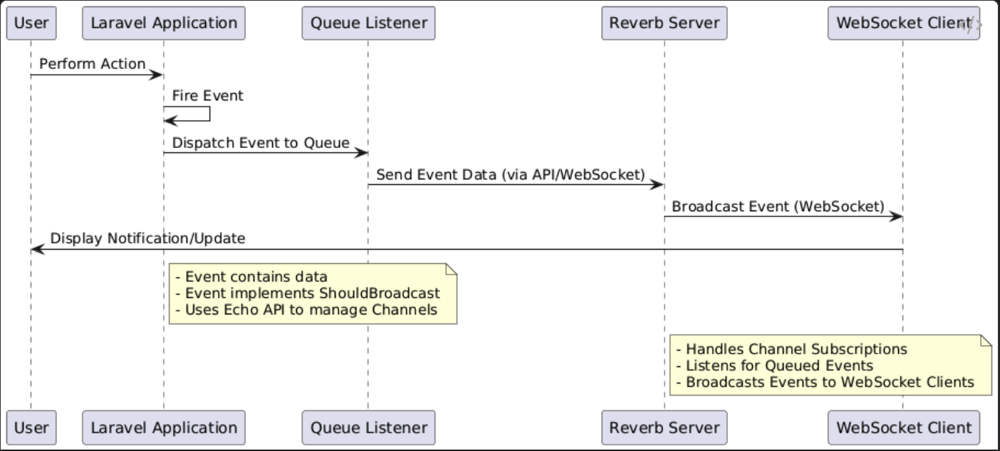

# laravel-11-websockets-demo
Laravel 11 websockets demo
> Live demo: [https://laravel-11-websockets-demo.domaindriven.net/](https://laravel-11-websockets-demo.domaindriven.net/)
<p align="center"><a href="https://laravel-11-websockets-demo.domaindriven.net/" target="_blank"></a></p>

## Nginx configuration for reverb pusher server proxy
```nginx
server {
	listen port ssl;
	listen [::]:port ssl;
	ssl_certificate path;
    ssl_certificate_key path

    ssl_protocols TLSv1.2 TLSv1.3;
    ssl_ciphers HIGH:!aNULL:!MD5;
	server_name  server_name;
	root path;
	index index.html index.php;

    location ~ ^/apps?{
        proxy_http_version 1.1;
        proxy_set_header Host $http_host;
        proxy_set_header Scheme $scheme;
        proxy_set_header SERVER_PORT $server_port;
        proxy_set_header REMOTE_ADDR $remote_addr;
        proxy_set_header X-Forwarded-For $proxy_add_x_forwarded_for;
        proxy_set_header Upgrade $http_upgrade;
        proxy_set_header Connection "Upgrade";
        #reverb server port
        proxy_pass http://0.0.0.0:reverse_proxy_port;

        # Prevent timeout for long WebSocket connections
        proxy_read_timeout 3600;
        proxy_send_timeout 3600;
        proxy_connect_timeout 3600;

        # Buffers for handling large WebSocket frames
        proxy_buffer_size 64k;
        proxy_buffers 4 128k;
        proxy_busy_buffers_size 256k;
    }


    location ~ \.php$ {
            include snippets/fastcgi-php.conf;
            fastcgi_pass unix:path to socket;
        }
}
```

## Supervisor configuration for reverb pusher server and queue listener
```shell
[program:queue-listen]
process_name=%(program_name)s
command=php path/to/artisan queue:listen --timeout=60 --sleep=5 --tries=3
autostart=true
autorestart=true
user=lws
redirect_stderr=true
stdout_logfile=/path/to/queue-listen.log

[program:reverb-start]
process_name=%(program_name)s
command=php path/to/artisan reverb:start
autostart=true
autorestart=true
user=lws
redirect_stderr=true
stdout_logfile=path/to/reverb-start.log
```


